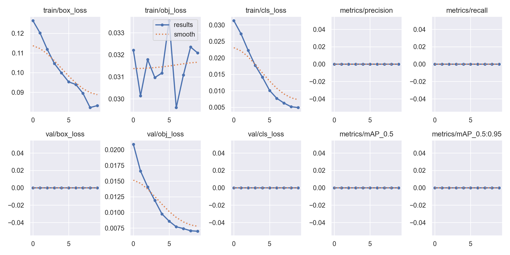
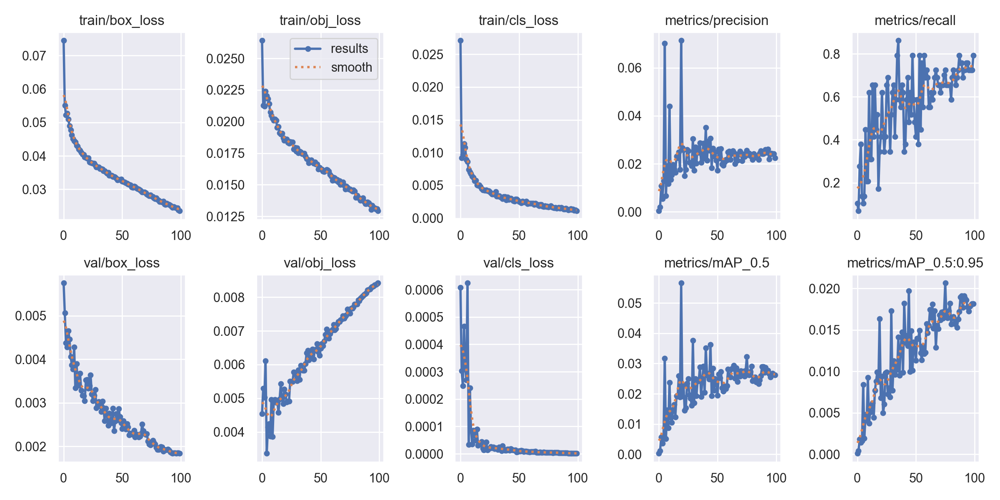

# 🔥 Detecção de Incêndios com YOLOv5

<p align="center">
  
</p>

## 📝 Resumo

Este projeto apresenta uma solução baseada em Deep Learning para a deteção automática de incêndios em imagens e vídeos, utilizando o modelo YOLOv5. O sistema é capaz de identificar focos de fogo em tempo real, sendo aplicável em cenários de monitorização florestal, industrial, urbano, entre outros.

## 💡 Motivação

Os incêndios representam uma ameaça significativa ao meio ambiente, à vida humana e à infraestrutura. A deteção precoce é fundamental para minimizar danos e salvar vidas. Soluções automáticas baseadas em visão computacional podem acelerar a resposta a emergências e reduzir custos operacionais.

## 🎯 Objetivos

- Detetar focos de incêndio em imagens e vídeos com elevada precisão e rapidez.
- Facilitar a integração do sistema em câmaras de monitorização e drones.
- Disponibilizar um pipeline completo, do treino à inferência, para uso académico e prático.

## ✨ Diferenciais do Projeto

- **Baseado em YOLOv5:** Um dos modelos mais rápidos e precisos para deteção de objetos.
- **Customização fácil:** Permite treinar com diferentes conjuntos de dados e ajustar hiperparâmetros.
- **Pipeline completo:** Inclui scripts para treino, inferência, avaliação e visualização de resultados.
- **Documentação detalhada:** README estruturado para facilitar o uso e a compreensão do projeto.

## ⚙️ Metodologia

1. **Recolha de Dados:** Utilização de datasets públicos e/ou próprios, organizados na pasta `datasets/`.
2. **Anotação:** As imagens são anotadas no formato YOLO (bounding boxes).
3. **Configuração:** O ficheiro `fire.yaml` define as classes e caminhos dos dados.
4. **Treino:** O modelo YOLOv5 é treinado com transfer learning, utilizando pesos pré-treinados.
5. **Avaliação:** Métricas como precisão, recall, F1-score e curvas PR são geradas.
6. **Inferência:** O modelo treinado é utilizado para detetar incêndios em novas imagens e vídeos.

## 🖥️ Requisitos

- Python 3.8+
- PyTorch
- OpenCV
- Dependências do YOLOv5 (ver `yolov5/requirements.txt`)
- MSS (para captura de tela)
- Geopy (para geolocalização)
- ExifRead (para extração de metadados de imagens)

## 📦 Instalação das Dependências

```bash
# Criar ambiente virtual
python -m venv venv
source venv/bin/activate  # Linux/Mac
venv\Scripts\activate     # Windows

# Instalar dependências principais
pip install -r yolov5/requirements.txt

# Instalar dependências adicionais
pip install mss geopy exifread geocoder
```

## 🔧 Configuração do Ambiente

1. **Câmera do Smartphone (Opcional):**
   - Instale o aplicativo Iriun Webcam no seu smartphone
   - Certifique-se que o smartphone e o computador estão na mesma rede WiFi
   - O script detectará automaticamente a câmera quando disponível

2. **Captura de Tela:**
   - O script `detect_fire_screen.py` requer permissões de acesso à tela
   - Em sistemas Linux, pode ser necessário configurar permissões X11
   - Em Windows, certifique-se que o Python tem permissões de administrador

3. **Geolocalização:**
   - Para extração de GPS de imagens, certifique-se que as imagens contêm metadados EXIF
   - Para detecção de localização em tempo real, uma conexão com internet é necessária

## 🚀 Como Utilizar

### 1. Clonar o repositório

```bash
git clone https://github.com/RodrigSM/Fire-detection-YoloV5.git
cd Fire-detection-YoloV5/yolov5-fire-detection
```

### 2. Instalar dependências
```bash
python -m venv venv
source venv/bin/activate  # Linux/Mac
venv\Scripts\activate     # Windows

pip install -r yolov5/requirements.txt
pip install mss geopy exifread geocoder
```

### 3. Preparar o dataset

- Coloca as tuas imagens e anotações em `datasets/`
- Edita o ficheiro `fire.yaml` para apontar para os teus dados

### 4. Treinar o modelo

```bash
python train.py --data data.yaml --weights yolov5s.pt --img 640 --batch-size 32 --device 0 --epochs 100
```

### 5. Visualizar resultados

- Detecções: pasta `results/`
- Métricas: gráficos em `results/`

## 🧪 Exemplos de Utilização

- **Monitorização florestal:** Drones ou câmaras fixas a detetar incêndios em tempo real.
- **Ambientes industriais:** Identificação de focos de fogo em fábricas e armazéns.
- **Cidades inteligentes:** Integração com sistemas de segurança urbana.

## 🗂 Estrutura do Projeto

```
yolov5-fire-detection/
│
├── yolov5/                # Código-fonte do YOLOv5
├── datasets/              # (Ignorado pelo git) Base de dados de treino/teste
├── model/                 # Modelos treinados (.pt)
├── results/               # Resultados de inferência e métricas
├── input.mp4              # Exemplo de vídeo de entrada
├── fire.yaml              # Configuração do dataset customizado
├── data.yaml              # Configuração do dataset padrão
├── train.ipynb            # Notebook de treino e avaliação
├── README.md              # Este ficheiro
└── ...                    # Outros ficheiros e scripts
```

## 🧩 Principais Ficheiros

- `yolov5/` - Código original do YOLOv5 (PyTorch)
- `yolov5/detect_fire.py` - Script customizado para deteção de fogo
- `model/yolov5s_best.pt` - Modelo treinado para deteção de incêndio
- `fire.yaml` - Configuração do dataset customizado
- `train.ipynb` - Notebook para experimentação e análise

## 🔥 Scripts de Deteção

### detect_fire.py
Este script implementa a deteção de incêndios em tempo real com as seguintes funcionalidades:
- Suporte para múltiplas fontes de entrada (webcam local, câmera IP, vídeos, imagens)
- Integração com Iriun Webcam para usar câmera do smartphone
- Análise de severidade do incêndio baseada em múltiplos fatores
- Deteção de GPS e localização do fogo
- Interface visual com informações em tempo real (FPS, status, coordenadas)
- Opção de salvar resultados em vídeo ou imagem

### detect_fire_screen.py
Uma versão estendida do detect_fire.py que adiciona:
- Captura de tela em tempo real para deteção de incêndios
- Análise de severidade aprimorada considerando:
  - Área total coberta pelo fogo
  - Número de detecções de fogo
  - Nível de confiança das detecções
  - Fator de propagação do fogo
- Sistema de pontuação para classificação de risco
- Suporte para múltiplos monitores
- Otimização de performance para captura de tela

Para usar estes scripts:
```bash
# Para deteção normal (câmera/vídeo/imagem)
python .\detect_fire.py --source 0

# Para deteção na tela
python .\detect_fire_screen.py --source 0
```

## 📚 Referências

- [YOLOv5 - Ultralytics](https://github.com/ultralytics/yolov5)
- [Documentação oficial do YOLOv5](https://docs.ultralytics.com/)
- [PyTorch](https://pytorch.org/)
- [Fire Dataset (Kaggle)](https://www.kaggle.com/datasets/atulyakumar98/fire-dataset)
- [Repositório Fire Detection](https://github.com/spacewalk01/yolov5-fire-detection)

## 📈 Comparação de Resultados: Dataset Pequeno vs. Dataset Grande

Abaixo, apresento uma comparação entre dois treinamentos realizados:

- **Treinamento 1 (exp9):** 100 imagens
- **Treinamento 2 (exp26):** 7.800 imagens

### 🔹 Resultados do Treinamento com 100 Imagens (exp9)

<p align="center">
  
</p>

### 🔹 Resultados do Treinamento com 7.800 Imagens (exp26)

<p align="center">
  
</p>

- **Observações:**  
  - O gráfico acima mostra as principais métricas do treino, como perdas (loss), precisão, recall e mAP.
  - Com mais imagens no dataset, as curvas tendem a ser mais suaves e os resultados mais estáveis.
  - O modelo treinado com mais dados apresenta melhor generalização e desempenho.

### 📊 Conclusão da Comparação

O aumento do número de imagens no dataset resultou num modelo muito mais robusto, fiável e aplicável a situações reais.  
**Quanto maior e mais variado o dataset, melhor o desempenho do modelo de deteção de incêndio!**

## 👨‍💻 Autores

- **Rodrigo Miranda** - r.miranda@ipvc.pt
- **Nelson Freitas** - nelsonfreitas@ipvc.pt

## 📄 Licença

Este projeto está sob a licença MIT. Veja o ficheiro [LICENSE](LICENSE) para mais detalhes.

